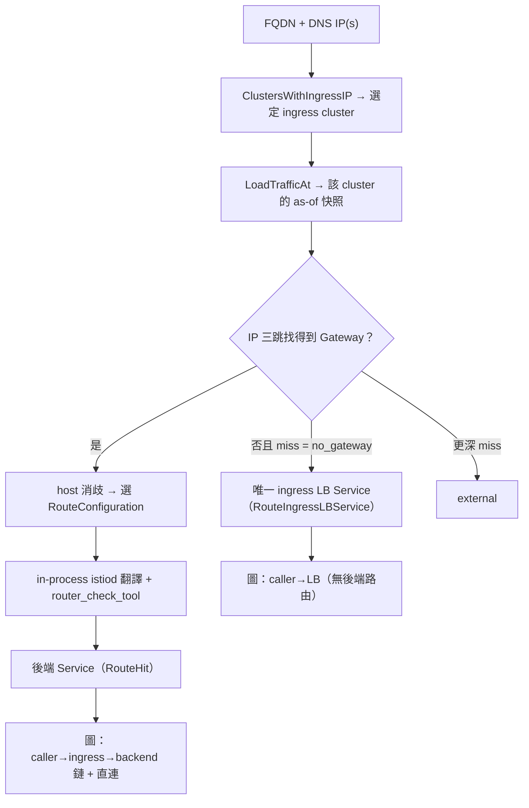

# Ingress 路由解析（kube-state-graph 現況）

> 說明本專案如何把 service-graph 裡的 **global FQDN + DNS IP** 解析成 Kubernetes
> Service，並在圖上呈現 Istio Gateway 路徑或非 Istio（例如 nginx）的 LB 終點。
>
> 概念流程另見 [route-resolution-flow.md](./route-resolution-flow.md)。

---

## 1. 範圍與開關

本功能是 **opt-in**：需同時設定 `--route-store-dsn` / `KSG_ROUTE_STORE_DSN` 與
`--router-check-bin`（Envoy `router_check_tool`）。未設定時行為與啟用前完全相同。

**本 repo 只做讀取與解析**。ClickHouse 版本化 store 的 watch / ingest / schema
由 metadata-exporter 維護；kube-state-graph 啟動時驗證 schema，不建表、不寫入。

時間語意為 **單點 as-of**：查詢時刻固定為 `/v1/graph` 時間窗的 **`end`**（與
service-graph `rate(...) @ end` 同一刻）。一次解析只看該瞬間的設定、只產生一個
outcome；沒有跨窗切段、沒有 per-version 結果列表。

---

## 2. 何時觸發

僅在 `resolveUnknownServerPeer` 路徑：client 已解析為**真實拓撲 pod**，server
標籤精確為 `"unknown"`，且 in-cluster DNS / ClusterIP ladder 無法解析、本來會落成
`external` 時。

| 維度 | 用途 |
|------|------|
| `client_net_peer_name`（優先）或 `client_server_address` | peer host（可含 `:<port>`） |
| `client_dns_answers` | 目的 IP（**必填**；無可解析 IP → 不諮詢引擎，記 `route_engine_no_ip`） |
| peer 上的 `:<port>` → `client_server_port` / `client_net_peer_port` → **443** | listener port |
| path | 固定 `"/"`（metric 無 path 維度） |

I/O 不進 parse：`ReadServiceGraph` 先做純函式 prescan（`collectRouteQueries`），
序列解析去重後的 key（各受 `--route-resolve-timeout` 約束），再把預取索引交給
`parseServiceGraphRoutes`。miss / error **永不 fail build**，一律退回
`external/<peer_address>`。

---

## 3. 整體流程



---

## 4. Ingress cluster 選定

每個目的 IP 呼叫 store 的**唯一跨叢集讀** `ClustersWithIngressIP(ip, at)`，得到候選
集合 G；再與 caller 的 cluster family（`build.ClusterFamilyKey`）交集：

| 條件 | 結果 |
|------|------|
| \|F\|==1（F = G ∩ family） | 取該 cluster |
| \|F\|>1 | caller ∈ F → caller；否則 ambiguous |
| F 空且 \|G\|==1 | 取該 cluster |
| F 空且 \|G\|>1 | caller ∈ G → caller；否則 ambiguous |
| G 空 | `no_ingress` |

多 IP 的選定必須一致，否則 ambiguous。候選集合 / 快照**從不跨 cluster 聯集**。
`(ip, at)` 探針可經 `BuildScoped` 在單次 build 內 memo（同一 IP 只讀 store 一次）。

`CallerCluster` 只供 family key 與平手決勝，不單獨決定載入哪個 snapshot。

---

## 5. IP → Gateway（三跳）

Gateway CR **沒有**「掛在哪個 LB IP」的反向欄位；靠 label selector 串起來：

```
IP
  → Hop1: Service.ingress_ips 命中 → LB Service + selector
  → Hop2: Deployment pod-template labels ⊇ selector → L
  → Hop3: Gateway.spec.selector ⊆ L，且 Gateway 與 ingress Service 同 namespace
  → 候選內以 FQDN 做 most-specific host 消歧（Istio exact/wildcard；
     同 specificity 取字典序最小 gateway 名）
```

`server.bind` / `hosts` 上的 `<ns>/` 綁定前綴在比對前剝除（對齊 istiod SNI 語意：
前綴限制 VS 能否綁定，不限制 client host）。

`ScopedFor` 取出該 Gateway + 綁定的 VirtualService + 後端 Service；`spec.gateways`
支援 `<ns>/<name>` 與同 ns bare name。

---

## 6. RouteConfiguration 選擇與比對

選定 Gateway 後，用 **port + host** 挑 Envoy RouteConfiguration
（`translate.ListenerFor`，Translate 與 resolver 共用）：

1. 篩出 listener port 上的 servers。
2. `gwresolve.PickHosts` 依 Istio exact/wildcard specificity 選 winner（與宣告順序無關；
   同 pattern 取較小索引）。
3. RC 命名對齊 istiod：
   - HTTP：`http.<port>[.<bind>]`（同 port 的 HTTP servers 共用）
   - HTTPS terminate：`https.<port>.<portName>.<gw>.<ns>[.<bind>]`（每 server 一條）
4. 三態：
   - `ListenerFound` → 繼續翻譯
   - `ListenerNoneOnPort` → `route_engine_no_listener_on_port`（port 上無可用 HTTP RDS）
   - `ListenerNoServerForHost` → `route_engine_no_server_for_host`（port 有 server，但不服務此 host；
     不跑 translate / tool）

通過後：in-process istiod `ConfigGenerator` 產生 RC，`router_check_tool` 以
`(host, path="/")` 比對，解析 cluster 字串
`outbound|<port>|<subset>|<svc>.<ns>.svc.cluster.local`。v1 **丟棄** port / subset，
只保留 `(cluster, namespace, service)` 餵給既有的 `resolveServiceLevel`（錨在選定的
ingress cluster；可跨 family 發出 `pod-calls-service`，並做 family-wide
`service-selects-pod` fan-out）。

---

## 7. 非 Istio 入口：LB Service fallback

當三跳找不到 Gateway（outcome 精確為 `no_gateway`——典型 nginx：Hop3 空）時，
對已載入快照做 as-of 身分去重（`ingressServiceIdentity`，不另讀 store）：

- 每個目的 IP 對應到唯一的 ingress LB `(namespace, name)`，且多 IP 一致 →
  `RouteIngressLBService`：把該 Service 當終點（host / path / port 不參與）。
- 任一 IP 對到多個身分 → `ambiguous_ingress_service` → external。
- 任一 IP 對到 0 個 → 保留原 pipeline miss。

更深層 miss（已有 Gateway 但 port / host / route 失敗）**不**遮成 LB fallback，
以保留診斷 reason。

LB 路徑用 `resolveServiceLevelInCluster`：service-selects-pod **只在鎖定的 ingress
cluster** 展開（LB IP 是 per-cluster 位址，不做 family union）。

> 本路徑只到 **ingress controller Service / Pods**。不解析 Kubernetes Ingress CR、
> 也不解析 nginx.conf 來追 backend；後端依賴若存在，來自 service-graph 流量本身，
> 不由本引擎推導。

---

## 8. 圖上呈現

### RouteHit（Istio）

前置條件齊備時，除 caller→backend **直連**外，另輸出完整鏈：

```
caller pod ──pod-calls-service──────────► ingress Service   labels.role=ingress-gateway
     │                                          │ service-selects-pod（鎖定 ingress cluster）
     │                                          ▼
     │                                     gateway pod(s)
     │                                          │ pod-calls-service（synthesized）
     │                                          ▼
     └──pod-calls-service─────────────────► backend Service ──service-selects-pod──► backend pods
```

- ingress 身分來自與 LB fallback 相同的 as-of 去重；ambiguous / 缺身分 → 不 demote hit，
  只退回純直連（無 stray 節點）。
- 合成邊 `labels.cluster` = ingress cluster；與 trace 已有的同 `(src,tgt)` 對以
  traced-edge-wins 去重。
- `role` 標記單調：`ingress-gateway` 可覆寫；`ingress-lb` 只寫入尚未設定的值。

### RouteIngressLBService（nginx 等）

```
caller pod ──pod-calls-service──► ingress LB Service   labels.role=ingress-lb
                                       │ service-selects-pod（鎖定 cluster）
                                       ▼
                                  controller pod(s)
```

無 routed backend、無合成 hop。隱藏 `ingress-lb` 會抹掉 caller 唯一依賴邊——消費端
「顯示 gateway 路徑」開關應只動 `ingress-gateway` 鏈，永遠保留 `ingress-lb` 與直連。

| | RouteHit | LB fallback |
|---|---|---|
| `labels.role` | `ingress-gateway` | `ingress-lb` |
| 後端 | 有（VS 路由） | 無 |
| 直連 caller→backend | 保留 | 不存在 |

---

## 9. Outcome → 日誌 reason

| Outcome | reason |
|---------|--------|
| （無 IP，prescan 跳過） | `route_engine_no_ip` |
| resolver error | `route_engine_error` |
| 拓撲缺目的 Service | `route_engine_dest_cluster_lacks_service` |
| `no_listener_on_port` | `route_engine_no_listener_on_port` |
| `no_server_for_host` | `route_engine_no_server_for_host` |
| `no_ingress` | `route_engine_no_ingress` |
| `ambiguous_ingress_cluster` | `route_engine_ambiguous_ingress_cluster` |
| `ambiguous_ingress_service` | `route_engine_ambiguous_ingress_service` |
| `no_gateway` / `no_route` | `route_engine_miss` |
| `hit` / `ingress_lb_service` | 成功（debug 區分） |

---

## 10. ClickHouse store（唯讀）

| 表 | 用途 |
|----|------|
| `service_versions` | ingress LB IP + selector；後端 Service ports |
| `deploy_versions` | ingress Deployment pod labels（Hop2） |
| `gw_versions` | Gateway selector + server_hosts + spec |
| `vs_versions` | VirtualService spec + bound gateways |

讀取契約：

- `LoadTrafficAt(cluster, ip, at)` — 單 cluster、as-of 快照
- `ClustersWithIngressIP(ip, at)` — 唯一跨 cluster 讀

**no-FINAL 模式**：SQL 只帶 immutable 條件與 `valid_from <= at`；client 端依
`ingest_seq` 去重後再套 `valid_from <= at < valid_to`。時間運算元用 `dt64Lit`，
不用 `?` bind。`--route-store-unique-rows` 可把 `valid_to` 放回 SQL（僅適用
update-close 寫入端）。`spec_json` 以 `DiscardUnknown` 解析。

**`cluster` 欄位的命名契約**：寫入 cluster 身分字串 `<az>-<env>-<cluster>`，
與 kube-state-metrics / kubelet 系列上 `az` + `env` + `cluster` 三個 label 合成的
值一致。原因是 raw cluster 名稱跨 zone/env 重複，圖上的每個 id、`labels.cluster`
與索引都以身分為鍵。

寫 raw 名稱仍可運作，但只在該名稱於單次 build 內**唯一**時：`pkg/build` 會把
`RouteDestination.Cluster` 與 ingress cluster 送進身分階梯的 adopt 步驟。名稱在
該次 build 對應到兩個身分時無法判定，該解析沿既有的
`route_engine_dest_cluster_lacks_service` 路徑退化成 external —— 不新增 outcome。
`RouteRequest.CallerCluster` 送出的一律是呼叫端 pod 的身分（供 family key 與
ingress 候選 tie-break 使用）。

---

## 11. 套件邊界

```
cmd/kube-state-graph          # 開 store、建 Resolver、注入 build.Options
pkg/build                     # RouteResolver 介面、prescan、parse 接點、圖鏈
  └── 不得 import pkg/route   # make check-route-containment
pkg/route                     # 引擎實作
  ├── resolver / ingresspick / ingresslb / scoped
  ├── snapshot                # 三跳、ScopedFor、IP→ingress Services
  ├── gwresolve               # host 比對、PickHosts
  ├── translate               # ListenerFor、istiod 翻譯
  ├── matchcheck              # router_check_tool
  └── store                   # ClickHouse 唯讀
```

不 dial Kubernetes apiserver；istio / client-go 僅作 in-memory 翻譯庫。

---

## 12. 刻意不做的事（現況邊界）

| 項目 | 現況 |
|------|------|
| 歷史區間 API（回傳每個版本 destination） | 未實作；store 仍保留完整 interval，graph 路徑只用 as-of |
| DestinationRule subset | cluster 字串有解析但 v1 丟棄 |
| EndpointSlice 當路由層 | 不用；拓撲的 `service-selects-pod` 仍走 KSM |
| Ingress CR / nginx.conf → backend | 未實作；非 Istio 只落到 LB Service |
| Sidecar mesh 視角 | 只做南北向 ingress |
| 新 node / edge type | 無；role 是既有 service 節點的 `labels` |

---

## 一句話

**DNS IP 鎖定入口叢集與門；FQDN + port 決定 Istio Gateway 上的 RouteConfiguration，再比對到後端 Service。沒有 Gateway 時，唯一的 ingress LB Service 就是終點。**
