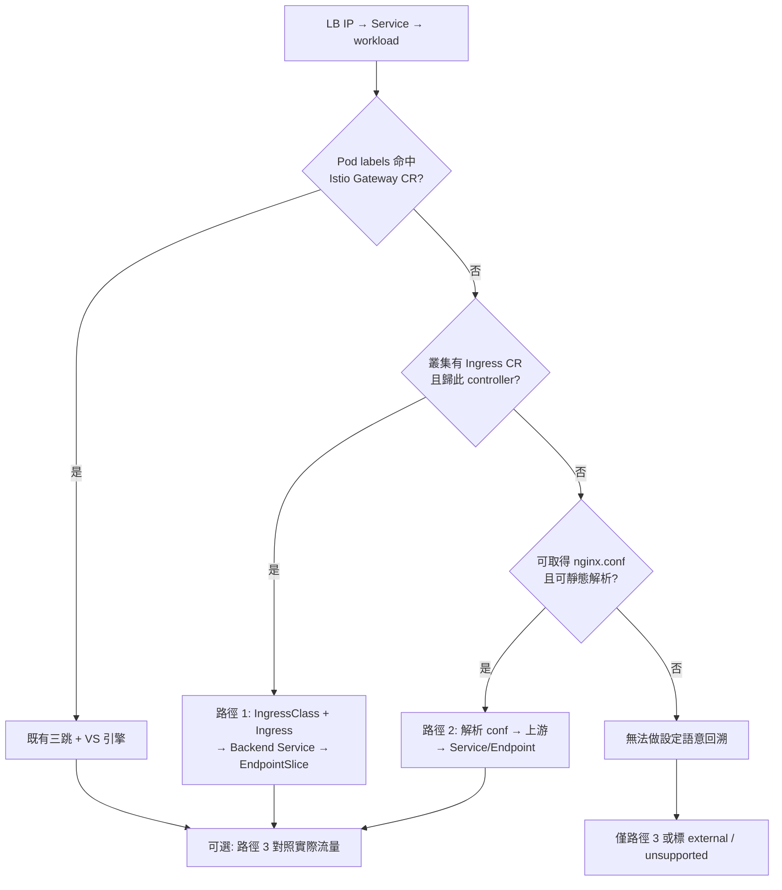

# Nginx（非 Istio Gateway）Ingress：從 LB IP 追到 Backend Pod

> 狀態：設計說明／補充文件。對照
> [istio-virtualservice-routing-history-design.md](./istio-virtualservice-routing-history-design.md)
> 中的 **IP → Gateway 三跳** 與 VirtualService 路由回溯。
>
> **適用情境**：某個 Service 有 `status.loadBalancer.ingress.ip`（或
> `spec.externalIPs`），但其 `selector` 選到的是 **nginx**（或 ingress-nginx
> controller）Pod，**不是** Istio `ingressgateway`。既有三跳在 Hop3
> （`Gateway.spec.selector ⊆ pod labels`）會落空，無法進入 VS → destination
> 解析。本文件說明找到 nginx 之後，實務上有哪幾條路可以再追到 **backend
> Service / Pod**。

---


## 1. 問題邊界

### 1.1 既有 Istio 三跳會停在哪裡

```
dst_ip
  → Hop1: has(ingress_ips, ip) → LB Service + selector
  → Hop2: selector ⊆ Deployment pod-template labels → nginx Deployment / Pods
  → Hop3: Gateway.spec.selector ⊆ nginx labels → 候選 Gateway CR
                                              ↓
                                    通常沒有 → 候選空
```

設計假設 workload 是 **Istio ingressgateway**，靠 `Gateway` CR 的 label
selector 反查。nginx 沒有對應的 Gateway CR 時：

- 路由引擎（ksg `pkg/route`）會落到 `no_ingress` / 既有 `external` 節點；
- **不會**自動展開 backend。

### 1.2 常見誤解：LB Service 的 EndpointSlice ≠ backend

| 展開對象 | EndpointSlice 給你的 |
|---|---|
| **ingress / LB Service** | nginx Pod 本身 |
| **backend Service** | 應用 Pod |

只做到「IP → nginx Pod」仍不夠；要 backend 必須再走一層**路由語意**
（Ingress / nginx.conf）或**流量語意**（span / service-graph）。

### 1.3 兩種查詢語意（與 Istio 文件對齊）

| 語意 | 問題 | 典型來源 |
|---|---|---|
| **設定語意** | 這個 host（+path）**應該**打到哪個 Service / Pod？ | Ingress、nginx.conf、VirtualService |
| **流量語意** | 這段時間 nginx **實際**打了誰？ | OTEL span、`traces_service_graph_*` |

兩者可能分歧（設定有 rule 但沒流量；或流量打到與設定不一致的目標）。API
或文件應標明模式，不要混成同一答案。

---


## 2. 三條路徑總覽


| # | 路徑 | 語意 | 前提 | 能回答 | 不能（單獨）回答 |
|---|---|---|---|---|---|
| **1** | IngressClass + Ingress + EndpointSlice | 設定 | Kubernetes Ingress Controller（如 ingress-nginx） | host/path → Backend Service → Pods | 自架、無 Ingress CR 的 nginx |
| **2** | Deployment → ConfigMap → 解析 nginx.conf | 設定 | 可取得 nginx 最終／掛載設定 | conf 裡的 upstream / proxy_pass 目標 | 穩定的 API schema；複雜 lua／模板 |
| **3** | nginx 送出的 span / service-graph | 流量 | nginx（或 sidecar / eBPF）有 instrumentation 且有流量 | nginx → 實際 peer（Service/Pod/external） | 完整 FQDN/path → backend 路由表 |


**建議優先順序**（目標與 Istio 設計同類——host+path+時間 → destination）：

1. **路徑 1**（有 Ingress CR 時）
2. **路徑 2**（沒有 Ingress CR、自管 conf 時）
3. **路徑 3**（補「實際打到誰」；不能單獨替代設定回溯）

---


## 3. 路徑 1：IngressClass + Ingress + EndpointSlice

### 3.1 一句話

**找到 Backend Service 的是 Ingress**；IngressClass 用來對上「這台 nginx」；
EndpointSlice 把 Backend Service 展開成 Pods。

加 watch 這三類 resource **並不能「直接」等於找到 backend**——完整鏈通常還要
保留既有的 **LB Service**（帶 loadBalancer IP）。

### 3.2 邏輯鏈

```
dst_ip
  → Service（ingress LB；ingress_ips 命中）
  → selector → nginx Pod / Deployment
  → 對上「這組 controller 管哪些 Ingress」
       （IngressClass，或 annotation kubernetes.io/ingress.class）
  → Ingress.spec.rules（host + path）
  → backend.service.name / port     ← 這裡得到 Backend Service
  → 該 Service 的 EndpointSlice
  → backend Pods
```

對某個具體查詢（例如 `api.example.com` + `/foo` + 時間 `T`）：

1. 用 IP 找到 nginx（既有三跳的 Hop1–Hop2，停在 Deployment/Pod）。
2. 用 IngressClass（或 class 名稱）收斂「這台 nginx 負責的 Ingress 集合」。
3. 在集合裡用 host/path 做比對（ingress-nginx 有自己的 precedence /
   first-match 規則；歷史查詢需用 `AsOf(T)` 版本）。
4. 取出 `backend.service`。
5. 對該 Backend Service 的 EndpointSlice（同樣 `AsOf(T)`）展開成 pods。

### 3.3 各 resource 的作用


| Resource | 作用 | 回答的問題 |
|---|---|---|
| **Service（LB）** | 掛外部 IP；selector 指向 nginx | 這個 IP 是哪組 ingress controller？ |
| **IngressClass** | 宣告 class 名稱 ↔ 哪個 controller | 哪些 Ingress 歸這組 nginx？ |
| **Ingress** | `host` / `path` → `backend.service` | 這個 host/path **設定上**打哪個 Service？ |
| **EndpointSlice** | Service → 就緒 endpoints（pod IP / `targetRef`） | 這個 Service **當下／該版本**背後有哪些 Pod？ |


重點：

- **Backend Service 來自 Ingress**，不是 EndpointSlice。
- EndpointSlice 是「Service → Pod」展開層：
  - 對 **ingress Service** 展開 → 只有 nginx Pod；
  - 對 **backend Service** 展開 → 才是應用 Pod。
- IngressClass **不是路由表**，是「歸屬／過濾」。多 controller / 多 class
  時幾乎必備；若叢集只有一個 nginx 且所有 Ingress 都歸它，實務上有時可放寬，
  但多 class 時省略會誤判。
- 若要做與 Istio 文件同類的**歷史回溯**，Ingress / IngressClass /
  EndpointSlice 都應納入版本化 store（interval：`valid_from` / `valid_to`），
  而非僅 scrape 當下。

### 3.4 與 Istio 路徑的對照


| Istio 路徑（既有設計） | nginx-ingress 路徑（本節） |
|---|---|
| Gateway CR | IngressClass / controller 歸屬 |
| VirtualService `http[]` | Ingress `spec.rules` |
| destination Service（+ port / subset） | `backend.service.{name,port}` |
| EndpointSlice（設計中選配） | EndpointSlice（要到 Pod 時視為必要） |

### 3.5 需要 watch／入庫的資源（建議）

在既有 VS / Gateway / DR / Service / ingress Deployment 之外，針對此路徑：

| GVR | 必要性 | 說明 |
|---|---|---|
| **IngressClass** | 高（多 class 時必須） | 過濾歸屬 |
| **Ingress** | 必須 | 路由表本體 |
| **EndpointSlice** | 要展開到 Pod 時必須 | 對 backend Service；可另保留 ingress Service 的 slice 供對照 |
| **Service（LB + backend）** | 必須 | LB 供 Hop1；backend 供名稱解析與 ports |

> 設計文件原文把 EndpointSlice 標成「選配」是相對於 **Istio 引擎輸出到
> Service+port 即可**的取證目標。若產品要求回答到 **Pod**，在 nginx 路徑應
> 視為非選配。

### 3.6 這條路回答／不回答什麼

- **回答**：設定語意下的 host（+path）→ Backend Service →（經 EndpointSlice）Pods。
- **不回答**：沒有 Ingress CR 的自架 nginx；僅存在於 nginx.conf 而未反映到
  Ingress 的規則；實際流量是否打到該 backend（那是路徑 3）。

---


## 4. 路徑 2：Deployment → ConfigMap → 解析 nginx.conf

### 4.1 一句話

從 nginx Deployment 的 volume mount 找到 ConfigMap（或 Secret），用 **nginx
設定語意**解析 `server` / `location` / `upstream` / `proxy_pass`，得到
IP、FQDN 或 in-cluster Service 名，再（若需要）展開到 Pods。

### 4.2 邏輯鏈

```
LB Service → selector → nginx Deployment
  → volumeMounts / 相關 env 指向的 ConfigMap（或 Secret）
  → 取出 nginx.conf（或 snippet、include、controller 生成後的完整 config）
  → 解析：
       server  { server_name ... }
       location ... { proxy_pass ... }  /  upstream { server ... }
  → 得到上游目標：
       - in-cluster Service DNS（*.svc.cluster.local 或短名）
       - ClusterIP / Pod IP
       - 外部 FQDN / IP
  → 若是本叢集 Service → EndpointSlice → Pods
```

### 4.3 典型 `proxy_pass` / `upstream` 形態


| conf 寫法 | 解析結果 | 下一步 |
|---|---|---|
| `proxy_pass http://my-svc.ns.svc.cluster.local:8080;` | K8s Service | EndpointSlice → Pods |
| `proxy_pass http://my-svc;`（同 ns 短名） | Service（需 ingress 所在 ns 脈絡） | 同上 |
| `upstream backend { server 10.x.x.x:8080; }` | IP | 反查是否為某 Service ClusterIP / Pod IP |
| `proxy_pass http://api.example.com;` | 外部或另一層入口 | 未必是本叢集 Service；可能需再走 DNS / 另一條入口解析 |

### 4.4 與路徑 1 的差別


| | 路徑 1（Ingress） | 路徑 2（解析 conf） |
|---|---|---|
| 路由來源 | K8s Ingress CR（結構化 API） | nginx 設定檔（字串／DSL） |
| host/path 語意 | Ingress `rules` | `server_name` + `location` |
| 穩定度 | 高（schema 固定） | 低（自管 conf、helm 模板、lua、變數、include） |
| 適用 | ingress-nginx 等 **Ingress Controller** | **手寫／自架** nginx；或要對「生成後最終 conf」做取證 |

實務上 ingress-nginx **控制器本身**也是「Ingress → 生成 nginx.conf」：

- 路徑 1 = 讀 **輸入**（Ingress CR）——偏好；
- 路徑 2 = 讀 **輸出**（最終 conf）——自架、或沒有 Ingress CR 時的後備。

### 4.5 歷史回溯時的額外成本

- ConfigMap 內容變更必須開新版本（與 LB `status.loadBalancer` IP 變更同類）。
- 解析器需能處理（至少）：`server_name`、prefix/exact `location`、
  `proxy_pass`（含 URI 改寫）、`upstream`、常見 `include`。
- lua / 外部 auth / 動態 upstream 往往無法靜態還原 → 應明確 degrade，不要猜。

### 4.6 這條路回答／不回答什麼

- **回答**：conf 裡寫死或可靜態推得的上游目標；再經 Service/Endpoint 到 Pods。
- **不回答**：無法靜態解析的動態路由；也不等同「實際流量打到誰」。

---


## 5. 路徑 3：nginx 的 span / service-graph（流量語意）

### 5.1 一句話

若 nginx（或其 sidecar / eBPF）有送出 trace / service-graph，可從 **nginx
Pod 的 outbound** 看到實際 peer；這是流量圖，**不是** FQDN/path 的完整路由表。

### 5.2 必要條件

- nginx 側有 instrumentation（OTEL span、Beyla/Alloy/`traces_service_graph_*` 等）；
- 查詢窗內**真的有流量**；
- 沒有流量或沒有 instrumentation → 這條路為空。

### 5.3 它告訴你什麼

- **實際呼叫關係**：nginx pod（或對應 identity）→ 某個 Service / Pod / external；
- 在 ksg 圖上可能是 `pod-calls-service` / `pod-calls-pod`（以及後續
  `service-selects-pod` fan-out）。

### 5.4 它通常不告訴你什麼（單靠 edge）

- 「這個 **FQDN / path** 在設定上對應哪個 backend」——那是路徑 1/2（或 Istio VS）
  的語意；
- service-graph 常是 peer 聚合，不一定帶完整 `Host` + path 維度；
- 即使個別 HTTP span 帶有 `http.host` / `url.path`，那也只是**觀測到的請求**，
  不是完整路由表——**沒被打到的 rule 不會出現**。

### 5.5 與設定路徑如何並存

| 需求 | 建議 |
|---|---|
| host+path → 應該去哪（取證／稽核） | 路徑 1 或 2（或 Istio 引擎） |
| 實際打了誰（除錯／對照） | 路徑 3 |
| 設定與流量不一致 | 兩者都算，標明 mismatch（同 Istio 文件的 config_only vs traffic_simulation） |

---


## 6. 決策指引（實作／產品）



實作時建議：

1. **明確區分**設定語意 vs 流量語意的 API／回應欄位（或模式旗標）。
2. Hop3 空時不要 silently 當「沒有 backend」——應區分
   `no_istio_gateway`（可改試 nginx 路徑）與真正的 `no_backend`。
3. EndpointSlice：若產品要回答到 Pod，在 nginx 路徑列為**必要 ingest**；
   若只回答到 Service+port，可止於 Ingress / conf。
4. 路徑 2 的解析器範圍寫死並 fail-soft；不要對 lua／動態 upstream 猜 destination。

---


## 7. 與現有文件／程式的關係


| 文件／元件 | 關係 |
|---|---|
| [istio-virtualservice-routing-history-design.md](./istio-virtualservice-routing-history-design.md) | Ingress 視角的 Istio 主路徑；本文件是 **nginx 邊界 LB** 的補充 |
| `openspec/changes/translate-global-fqdn-to-k8s-service/` | ksg 將 global FQDN 經 **Istio** route engine 解析到 Service；nginx 不在該 change 範圍 |
| `pkg/route` 三跳 + `ClustersWithIngressIP` | Hop1 仍可用（IP → LB Service）；Hop3 對 nginx 會空 → 今日 degrade 為 external |
| `openspec/changes/ingress-lb-service-fallback/` | **LB 層降級已由此 change 實作**：Istio pipeline 全 miss 後，IP 在已選 ingress cluster 內唯一對應的 ingress LB Service 以 `ingress_lb_service` outcome 回傳（僅到 LB 層，不含 backend 解析）；圖上該節點標 `labels.role="ingress-lb"`（mark-ingress-route-path），與 Istio 鏈的 `ingress-gateway` 可區分 |

**本文件不變更**既有 Istio 引擎契約；僅記錄 nginx 情境的可行後續路徑，供後續
OpenSpec change / 實作引用。

---


## 8. 一句話總結

LB Service 選到 nginx 時，既有「IP → Istio Gateway → VirtualService」鏈在
Hop3 結束。要再追 backend：**優先用 Ingress（+ IngressClass）做設定語意、
EndpointSlice 展開到 Pod**；沒有 Ingress CR 時才解析 nginx.conf；span /
service-graph 只能證明「nginx 實際打了誰」，不能單獨還原 FQDN/path 的完整
路由表。
